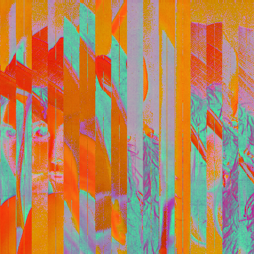

# pixSort

A C++ command-line tool for applying advanced pixel sorting effects to images using OpenCV, with support for multiple color spaces.

This project allows you to create unique "glitch art" by sorting image pixels based on various methods and in different color spaces, offering a wide range of creative possibilities.

## Features

- **Multiple Sorting Methods**: Apply horizontal, vertical, or random sorting algorithms.
- **Color Space Transformations**: Perform sorting in different color spaces (`HSV`, `LAB`, `YCrCB`) to target different visual components of an image.
- **Threshold-based Sorting**: Only sort pixels that are brighter than a specified threshold.
- **Flexible Output**: Choose to output the final image in the standard BGR format or keep it in the transformed color space.
- **Powerful CLI**: A clear and flexible command-line interface for combining effects.

## Dependencies

- **C++17** compatible compiler (GCC, Clang, MSVC)
- **CMake 3.10** or higher
- **OpenCV 4.12.0**

## Getting Started

### Prerequisites

First, ensure you have the dependencies installed on your system.

**On Ubuntu/Debian:**
```bash
sudo apt-get update
sudo apt-get install build-essential cmake libopencv-dev
```

**On macOS (using Homebrew):**
```bash
brew install opencv
```

### Building

1.  Clone the repository:
    ```bash
    git clone https://github.com/nunziatodamino/pixel_sorting.git
    cd pixel_sorting
    ```

2.  Create a build directory and run CMake:
    ```bash
    mkdir build && cd build
    cmake ..
    ```

3.  Compile the project:
    ```bash
    make
    ```
    The executable `pixSort` will be created inside the `build` directory.

## Usage

The tool is controlled via a set of command-line options to specify the input/output files, sorting method, color space, and other parameters.

### Command-Line Options

| Flag | Option | Description | Default | Required |
| :--- | :--- | :--- | :--- | :---: |
| `-i` | `--input` | Input image file. | | Yes |
| `-o` | `--output` | Output image file. | | Yes |
| `-m` | `--method` | Sorting method. **Options**: `horizontal`, `vertical`, `random`. | | Yes |
| `-c` | `--color` | Color space for sorting. **Options**: `HSV`, `LAB`, `YCrCb`. | `BGR` | No |
| `-t` | `--threshold` | Brightness threshold for sorting (range: 0-765). | `0` | No |
| `-e` | `--entropy` | Relative entropy (percentage) for random sort (0.0-1.0). | `0.0` | No |
| `-w` | `--write` | Write the result to the specified output file. | `false` | No |
| `-x` | `--transform`| Output the image in the transformed color space without converting back to BGR. | `false` | No |

### Example Usages

Here are some examples demonstrating how to combine the different options for creative effects.

**1. Sort by Value in the HSV Color Space**

This command converts the image to HSV and then performs a horizontal sort. In HSV, the first channel is Hue, the second is Saturation, and the third is Value (brightness). The sorting algorithm sums the channels, so this will primarily sort based on a combination of S and V.

```bash
./build/pixSort -i images/Lenna.png -o images/Lenna_hsv_horizontal.png -m horizontal -c HSV -w
```

**2. Sort by Lightness in the LAB Color Space**

This command converts the image to the LAB color space and performs a vertical sort with a threshold of 120. In LAB, the 'L' channel represents lightness. This allows you to sort pixels based on their perceptual lightness, which can produce very clean results.

```bash
./build/pixSort -i images/lion.png -o images/lion_lab_vertical.png -m vertical -c LAB -t 120 -w
```

**3. Random Sort in the YCrCb Color Space**

This applies a random sort to 50% of the pixels after converting the image to YCrCb, a color space often used in video compression.

```bash
./build/pixSort -i images/sphere.jpeg -o images/sphere_ycrcb_random.jpeg -m random -c YCrCb -e 0.5 -w
```

**4. Visualize the Transformed Color Space**

This command converts the image to HSV and then writes the output *without* converting back to BGR. This is useful for visualizing what the different color spaces look like.

```bash
./build/pixSort -i images/Lenna.png -o images/Lenna_hsv_raw.png -m horizontal -c HSV -w -x
```

**5. High-Threshold Sort in HSV and Visualize Result**

This command demonstrates multiple features at once. It converts the `Lenna.png` image to the `HSV` color space, performs a `horizontal` sort on only the absolute brightest pixels (threshold `699` out of 765), and then saves the output image (`-w`) *without* converting back to the BGR color space (`-x`). The result is an abstract image where the sorted HSV pixel data is interpreted as BGR, creating a unique artistic effect.

```bash
./build/pixSort -i images/Lenna.png -o images/rand.png -m horizontal -t 699 -c HSV -x -w
```

| Before | After |
| :---: | :---: |
|  |  |

## License

This project is licensed under the **MIT License**. See the [LICENSE](LICENSE) file for details.
